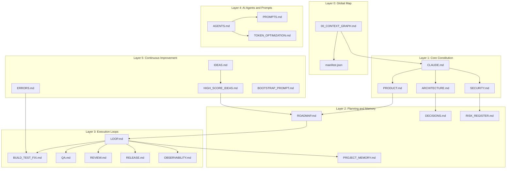

# Context Graph (00_CONTEXT_GRAPH.md)

## Purpose
This document provides the master map and dependency graph of the entire AI operating system documentation infrastructure. It establishes the entry points, task-specific loading strategies, and rules for token-efficient agent operation.

* **When to read it:** At the start of every session or task execution.
* **What it controls:** Initial context selection, execution flow, and file dependencies.
* **What it must not contain:** Specific implementation details of the application, code snippets, or raw features.
* **Which files it depends on:** None (Self-contained).
* **Which files depend on it:** All other files in this documentation system.

---

## File Hierarchy and Architecture

The documentation system is divided into 6 distinct layers, forming an execution pipeline:

---

## Task-to-Context Loading Table

To prevent token waste, read only the minimal subset of files required for your specific task:

| Task Type | Files to Load (Priority Order) | Key Control Document |
| :--- | :--- | :--- |
| **New Feature Planning** | [PRODUCT.md](file:///c:/Users/huseyinekizoglu/Documents/Bilet%20Uygulamas%C4%B1/PRODUCT.md), [ROADMAP.md](file:///c:/Users/huseyinekizoglu/Documents/Bilet%20Uygulamas%C4%B1/ROADMAP.md), [PROJECT_MEMORY.md](file:///c:/Users/huseyinekizoglu/Documents/Bilet%20Uygulamas%C4%B1/PROJECT_MEMORY.md) | [PRODUCT.md](file:///c:/Users/huseyinekizoglu/Documents/Bilet%20Uygulamas%C4%B1/PRODUCT.md) |
| **Bug Fixing** | [BUILD_TEST_FIX.md](file:///c:/Users/huseyinekizoglu/Documents/Bilet%20Uygulamas%C4%B1/BUILD_TEST_FIX.md), [ERRORS.md](file:///c:/Users/huseyinekizoglu/Documents/Bilet%20Uygulamas%C4%B1/ERRORS.md), [PROJECT_MEMORY.md](file:///c:/Users/huseyinekizoglu/Documents/Bilet%20Uygulamas%C4%B1/PROJECT_MEMORY.md) | [BUILD_TEST_FIX.md](file:///c:/Users/huseyinekizoglu/Documents/Bilet%20Uygulamas%C4%B1/BUILD_TEST_FIX.md) |
| **Security Review** | [SECURITY.md](file:///c:/Users/huseyinekizoglu/Documents/Bilet%20Uygulamas%C4%B1/SECURITY.md), [RISK_REGISTER.md](file:///c:/Users/huseyinekizoglu/Documents/Bilet%20Uygulamas%C4%B1/RISK_REGISTER.md) | [SECURITY.md](file:///c:/Users/huseyinekizoglu/Documents/Bilet%20Uygulamas%C4%B1/SECURITY.md) |
| **Refactoring** | [ARCHITECTURE.md](file:///c:/Users/huseyinekizoglu/Documents/Bilet%20Uygulamas%C4%B1/ARCHITECTURE.md), [DECISIONS.md](file:///c:/Users/huseyinekizoglu/Documents/Bilet%20Uygulamas%C4%B1/DECISIONS.md), [QA.md](file:///c:/Users/huseyinekizoglu/Documents/Bilet%20Uygulamas%C4%B1/QA.md) | [ARCHITECTURE.md](file:///c:/Users/huseyinekizoglu/Documents/Bilet%20Uygulamas%C4%B1/ARCHITECTURE.md) |
| **Release Preparation** | [RELEASE.md](file:///c:/Users/huseyinekizoglu/Documents/Bilet%20Uygulamas%C4%B1/RELEASE.md), [REVIEW.md](file:///c:/Users/huseyinekizoglu/Documents/Bilet%20Uygulamas%C4%B1/REVIEW.md), [ROADMAP.md](file:///c:/Users/huseyinekizoglu/Documents/Bilet%20Uygulamas%C4%B1/ROADMAP.md) | [RELEASE.md](file:///c:/Users/huseyinekizoglu/Documents/Bilet%20Uygulamas%C4%B1/RELEASE.md) |
| **Idea Scoring** | [IDEAS.md](file:///c:/Users/huseyinekizoglu/Documents/Bilet%20Uygulamas%C4%B1/IDEAS.md), [HIGH_SCORE_IDEAS.md](file:///c:/Users/huseyinekizoglu/Documents/Bilet%20Uygulamas%C4%B1/HIGH_SCORE_IDEAS.md) | [HIGH_SCORE_IDEAS.md](file:///c:/Users/huseyinekizoglu/Documents/Bilet%20Uygulamas%C4%B1/HIGH_SCORE_IDEAS.md) |
| **Architecture Change** | [ARCHITECTURE.md](file:///c:/Users/huseyinekizoglu/Documents/Bilet%20Uygulamas%C4%B1/ARCHITECTURE.md), [DECISIONS.md](file:///c:/Users/huseyinekizoglu/Documents/Bilet%20Uygulamas%C4%B1/DECISIONS.md) | [ARCHITECTURE.md](file:///c:/Users/huseyinekizoglu/Documents/Bilet%20Uygulamas%C4%B1/ARCHITECTURE.md) |
| **Token Optimization** | [TOKEN_OPTIMIZATION.md](file:///c:/Users/huseyinekizoglu/Documents/Bilet%20Uygulamas%C4%B1/TOKEN_OPTIMIZATION.md) | [TOKEN_OPTIMIZATION.md](file:///c:/Users/huseyinekizoglu/Documents/Bilet%20Uygulamas%C4%B1/TOKEN_OPTIMIZATION.md) |
| **Agent Creation** | [AGENTS.md](file:///c:/Users/huseyinekizoglu/Documents/Bilet%20Uygulamas%C4%B1/AGENTS.md), [PROMPTS.md](file:///c:/Users/huseyinekizoglu/Documents/Bilet%20Uygulamas%C4%B1/PROMPTS.md) | [AGENTS.md](file:///c:/Users/huseyinekizoglu/Documents/Bilet%20Uygulamas%C4%B1/AGENTS.md) |
| **Production Incident** | [OBSERVABILITY.md](file:///c:/Users/huseyinekizoglu/Documents/Bilet%20Uygulamas%C4%B1/OBSERVABILITY.md), [ERRORS.md](file:///c:/Users/huseyinekizoglu/Documents/Bilet%20Uygulamas%C4%B1/ERRORS.md), [RELEASE.md](file:///c:/Users/huseyinekizoglu/Documents/Bilet%20Uygulamas%C4%B1/RELEASE.md) | [OBSERVABILITY.md](file:///c:/Users/huseyinekizoglu/Documents/Bilet%20Uygulamas%C4%B1/OBSERVABILITY.md) |
| **Store Policy Review** | [SECURITY.md](file:///c:/Users/huseyinekizoglu/Documents/Bilet%20Uygulamas%C4%B1/SECURITY.md), [RISK_REGISTER.md](file:///c:/Users/huseyinekizoglu/Documents/Bilet%20Uygulamas%C4%B1/RISK_REGISTER.md) | [SECURITY.md](file:///c:/Users/huseyinekizoglu/Documents/Bilet%20Uygulamas%C4%B1/SECURITY.md) |
| **Performance Imp.** | [QA.md](file:///c:/Users/huseyinekizoglu/Documents/Bilet%20Uygulamas%C4%B1/QA.md), [OBSERVABILITY.md](file:///c:/Users/huseyinekizoglu/Documents/Bilet%20Uygulamas%C4%B1/OBSERVABILITY.md), [ARCHITECTURE.md](file:///c:/Users/huseyinekizoglu/Documents/Bilet%20Uygulamas%C4%B1/ARCHITECTURE.md) | [QA.md](file:///c:/Users/huseyinekizoglu/Documents/Bilet%20Uygulamas%C4%B1/QA.md) |

---

## Token-Saving Context Loading Rules
1. **Never load all documents:** Look at the Task-to-Context table above and load only the direct dependencies.
2. **Consult [PROJECT_MEMORY.md](file:///c:/Users/huseyinekizoglu/Documents/Bilet%20Uygulamas%C4%B1/PROJECT_MEMORY.md) first:** This holds the summarized active state. Only read full files when the summary is insufficient.
3. **Keep files modular:** Do not allow documents to grow past 500 lines. Use structured files like [DECISIONS.md](file:///c:/Users/huseyinekizoglu/Documents/Bilet%20Uygulamas%C4%B1/DECISIONS.md) to log historical records.

Last updated: 2026-07-23
Related files: [manifest.json](file:///c:/Users/huseyinekizoglu/Documents/Bilet%20Uygulamas%C4%B1/manifest.json), [CLAUDE.md](file:///c:/Users/huseyinekizoglu/Documents/Bilet%20Uygulamas%C4%B1/CLAUDE.md), [TOKEN_OPTIMIZATION.md](file:///c:/Users/huseyinekizoglu/Documents/Bilet%20Uygulamas%C4%B1/TOKEN_OPTIMIZATION.md)
