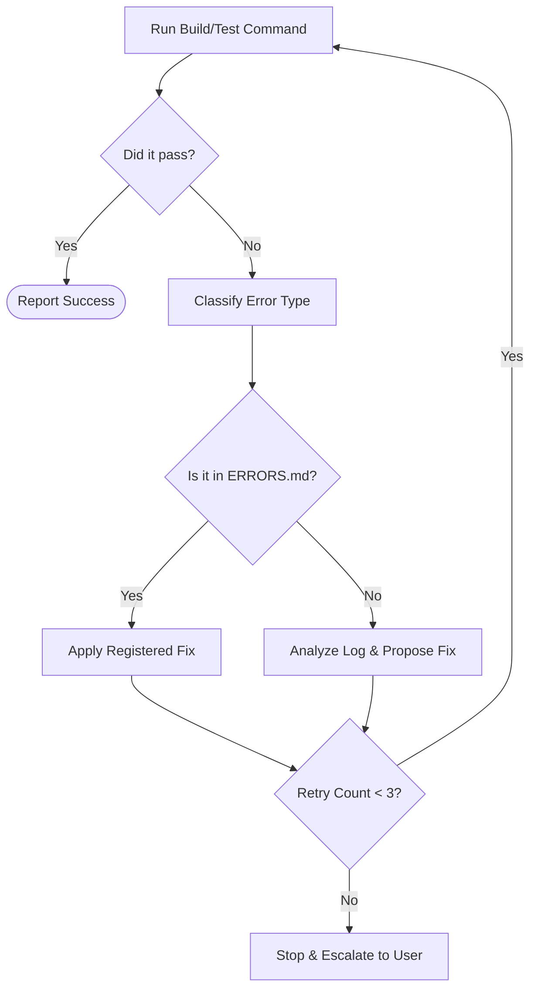

# Build, Test, and Fix Loop (BUILD_TEST_FIX.md)

## Purpose
This document controls the exact commands used to build, test, and lint the application, and specifies the recovery procedure when execution steps fail.

* **When to read it:** When executing builds, running test suites, resolving lint issues, or entering an error recovery cycle.
* **What it controls:** Execution commands, error classification, retry limits, and escalation rules.
* **What it must not contain:** Quality thresholds or definitions of done (refer to [QA.md](file:///c:/Users/huseyinekizoglu/Documents/Bilet%20Uygulamas%C4%B1/QA.md)).
* **Which files it depends on:** [LOOP.md](file:///c:/Users/huseyinekizoglu/Documents/Bilet%20Uygulamas%C4%B1/LOOP.md), [ERRORS.md](file:///c:/Users/huseyinekizoglu/Documents/Bilet%20Uygulamas%C4%B1/ERRORS.md)
* **Which files depend on it:** [QA.md](file:///c:/Users/huseyinekizoglu/Documents/Bilet%20Uygulamas%C4%B1/QA.md)

---

## Command Reference

| Project Part | Action | Command |
| :--- | :--- | :--- |
| **Backend** | Build | None (Node.js runtime) |
| **Backend** | Test | `node backend/test-api.js` / `node backend/test-e2e.js` |
| **Backend** | Database Sync | `npx prisma db push` |
| **Frontend** | Dev Start | `npm --prefix frontend run dev` |
| **Frontend** | Build | `npm --prefix frontend run build` |
| **Frontend** | Lint | `npm --prefix frontend run lint` |
| **Legacy GAS** | Validate Code | `npx clasp status` |
| **Legacy GAS** | Deploy Code | `npx clasp push --force` |

---

## Failure Recovery Loop & Escalation Rules

### 1. Failure Classification
* **Class A (Syntax/Typo):** Instant fix. Check imports and typings.
* **Class B (Dependency):** Missing npm package. Do NOT install without user permission unless specified in `package.json`.
* **Class C (Environment/State):** Port in use, database locked, missing `.env`.
* **Class D (Logical/Assertion):** Test failure. Re-read [PRODUCT.md](file:///c:/Users/huseyinekizoglu/Documents/Bilet%20Uygulamas%C4%B1/PRODUCT.md) and [ARCHITECTURE.md](file:///c:/Users/huseyinekizoglu/Documents/Bilet%20Uygulamas%C4%B1/ARCHITECTURE.md).

### 2. Loop Constraints
* **Maximum attempts:** Do not run the fix-and-retry cycle more than **3 times** for the same issue.
* **Registry check:** Before writing any fix, verify against [ERRORS.md](file:///c:/Users/huseyinekizoglu/Documents/Bilet%20Uygulamas%C4%B1/ERRORS.md) to ensure you are not applying a fix that previously failed.

### 3. Escalation Policy
If a fix fails 3 times:
1. Stop running commands.
2. Log the exact symptoms, error output, and failed attempts in [ERRORS.md](file:///c:/Users/huseyinekizoglu/Documents/Bilet%20Uygulamas%C4%B1/ERRORS.md).
3. Report the state to the user and request manual intervention.

Last updated: TODO
Related files: [ERRORS.md](file:///c:/Users/huseyinekizoglu/Documents/Bilet%20Uygulamas%C4%B1/ERRORS.md), [QA.md](file:///c:/Users/huseyinekizoglu/Documents/Bilet%20Uygulamas%C4%B1/QA.md)
