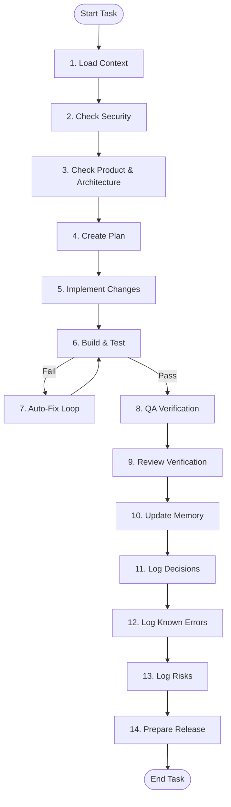

# Core Development Loop (LOOP.md)

## Purpose
This document defines the standard execution cycle that all AI agents must follow when executing a task. It ensures structure, quality gates, and cost-efficient context loading.

* **When to read it:** Before starting any active task or modifying files.
* **What it controls:** Development loop flow, testing stages, memory commits.
* **What it must not contain:** Command lists or test arguments (refer to [BUILD_TEST_FIX.md](file:///c:/Users/huseyinekizoglu/Documents/Bilet%20Uygulamas%C4%B1/BUILD_TEST_FIX.md)).
* **Which files it depends on:** [CLAUDE.md](file:///c:/Users/huseyinekizoglu/Documents/Bilet%20Uygulamas%C4%B1/CLAUDE.md), [00_CONTEXT_GRAPH.md](file:///c:/Users/huseyinekizoglu/Documents/Bilet%20Uygulamas%C4%B1/00_CONTEXT_GRAPH.md)
* **Which files depend on it:** All execution documents.

---

## The 14-Step Agent Loop

### Detailed Loop Execution Steps

1. **Load Context:** Look up the task type in [00_CONTEXT_GRAPH.md](file:///c:/Users/huseyinekizoglu/Documents/Bilet%20Uygulamas%C4%B1/00_CONTEXT_GRAPH.md) and load only the required files.
2. **Check Security:** Read [SECURITY.md](file:///c:/Users/huseyinekizoglu/Documents/Bilet%20Uygulamas%C4%B1/SECURITY.md) to ensure no policies are compromised.
3. **Check Product & Architecture:** Review [PRODUCT.md](file:///c:/Users/huseyinekizoglu/Documents/Bilet%20Uygulamas%C4%B1/PRODUCT.md) and [ARCHITECTURE.md](file:///c:/Users/huseyinekizoglu/Documents/Bilet%20Uygulamas%C4%B1/ARCHITECTURE.md) to align specifications.
4. **Create Plan:** Outline code paths, file creations, and tests.
5. **Implement Changes:** Write/edit files in contiguous blocks using the narrowest-scoped tools.
6. **Build & Test:** Run the build/test commands as defined in [BUILD_TEST_FIX.md](file:///c:/Users/huseyinekizoglu/Documents/Bilet%20Uygulamas%C4%B1/BUILD_TEST_FIX.md).
7. **Auto-Fix Loop:** If a test or build fails, enter the repair cycle in [BUILD_TEST_FIX.md](file:///c:/Users/huseyinekizoglu/Documents/Bilet%20Uygulamas%C4%B1/BUILD_TEST_FIX.md).
8. **QA Verification:** Verify the feature against the criteria in [QA.md](file:///c:/Users/huseyinekizoglu/Documents/Bilet%20Uygulamas%C4%B1/QA.md).
9. **Review Verification:** Conduct the logical judgment checks defined in [REVIEW.md](file:///c:/Users/huseyinekizoglu/Documents/Bilet%20Uygulamas%C4%B1/REVIEW.md).
10. **Update Memory:** Summarize current progress in [PROJECT_MEMORY.md](file:///c:/Users/huseyinekizoglu/Documents/Bilet%20Uygulamas%C4%B1/PROJECT_MEMORY.md).
11. **Log Decisions:** If architecture was changed, add an ADR entry to [DECISIONS.md](file:///c:/Users/huseyinekizoglu/Documents/Bilet%20Uygulamas%C4%B1/DECISIONS.md).
12. **Log Known Errors:** Add encountered exceptions and fix summaries to [ERRORS.md](file:///c:/Users/huseyinekizoglu/Documents/Bilet%20Uygulamas%C4%B1/ERRORS.md).
13. **Log Risks:** Register new concerns in [RISK_REGISTER.md](file:///c:/Users/huseyinekizoglu/Documents/Bilet%20Uygulamas%C4%B1/RISK_REGISTER.md).
14. **Prepare Release:** If the code is production-ready, trigger [RELEASE.md](file:///c:/Users/huseyinekizoglu/Documents/Bilet%20Uygulamas%C4%B1/RELEASE.md).

---

## Core Execution Document Selection
* **Quality Criteria** are defined in [QA.md](file:///c:/Users/huseyinekizoglu/Documents/Bilet%20Uygulamas%C4%B1/QA.md).
* **Command Executions** to meet those criteria are in [BUILD_TEST_FIX.md](file:///c:/Users/huseyinekizoglu/Documents/Bilet%20Uygulamas%C4%B1/BUILD_TEST_FIX.md).
* **Deliberate Approval & Safety checks** are handled in [REVIEW.md](file:///c:/Users/huseyinekizoglu/Documents/Bilet%20Uygulamas%C4%B1/REVIEW.md).
* **Deployment & Submissions** are managed in [RELEASE.md](file:///c:/Users/huseyinekizoglu/Documents/Bilet%20Uygulamas%C4%B1/RELEASE.md).

Last updated: 2026-07-23
Related files: [BUILD_TEST_FIX.md](file:///c:/Users/huseyinekizoglu/Documents/Bilet%20Uygulamas%C4%B1/BUILD_TEST_FIX.md), [QA.md](file:///c:/Users/huseyinekizoglu/Documents/Bilet%20Uygulamas%C4%B1/QA.md), [REVIEW.md](file:///c:/Users/huseyinekizoglu/Documents/Bilet%20Uygulamas%C4%B1/REVIEW.md), [RELEASE.md](file:///c:/Users/huseyinekizoglu/Documents/Bilet%20Uygulamas%C4%B1/RELEASE.md)
